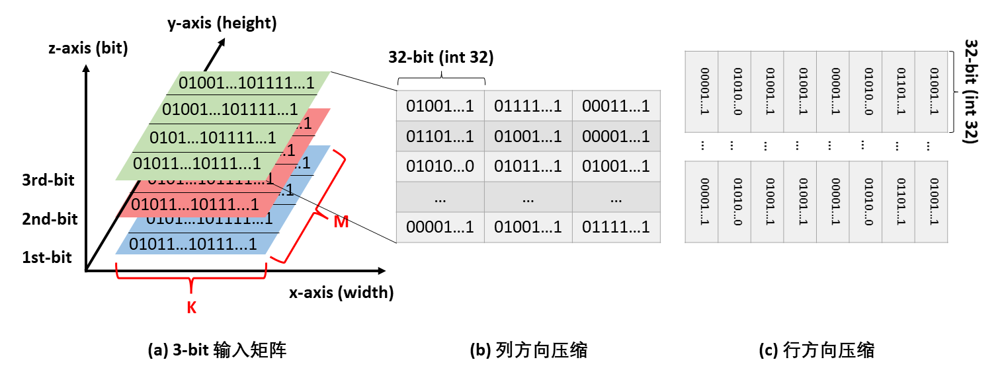
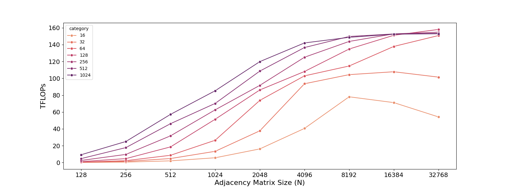

# 2024秋高级计算机体系结构课程大作业
1.	论文需要选择近三年“计算机体系结构/系统”CCF-A 类会议论文（推荐 ISCA、MICRO、HCPA、 ASPLOS、OSDI、SC）；
2.	选择与课程上讲过的知识相关的论文进行复现（包括但不限于：指令级并行、数据级并行、线程级并行、高速缓存一致性、高性能互连网络等）；
3.	允许一到三名同学组队完成项目，但最终组内每个人都需要上交一份项目报告；每个小组复现的论文应包含若干项技术点，每个小组成员在编写项目报告中的” 关键技术” 部分时不能选择相同的技术点进行阐述，每个小组成员在复现实验的比较部分不能选择相同的技术指标进行对比分析；
4.	项目报告以中文阐述，图示也是中文描述，不能复制粘贴论文中文字、数据、图示等，比如一些系统设计图，需要结合自己的理解重新绘制；
5.	截止提交时间：2024 年 12 月 31 日。其他要求请见报告模板。

# 小组完成情况
**小组成员**：周呈星 24214361	黄羽良24214310

**分工信息**：我们选择复现[YUKE WANG的相关工作](https://github.com/YukeWang96)，两人均参与对该作者仓库中工作的查阅与筛选，最终讨论后选择投稿在PPOPP 2022的“QGTC: Accelerating Quantized GNN via GPU Tensor Core”工作。初期由周呈星负责项目代码的复现，由黄羽良负责论文内容的剖析。后续进行讨论交流，两人分别从代码实现和论文脉络两方面向对方介绍该工作，并确定两人后续报告中内容分工。该工作技术点主要包括QGTC算法设计和具体实现中的六部分技术。算法设计部分，两人均会根据各自的理解进行阐述，核心技术点方面由周呈星阐述子图划分和批处理、3D堆叠位压缩和带宽优化的子图打包三项技术；由黄羽良阐述零块跳跃、非零块重用和层间内核融合三项技术。实验方面由黄羽良负责详细分析论文中图7中Cluster GCN 上的 DGL 和在batched GIN上的DGL中DGL与不同带宽下QGTC的性能差距；由周呈星负责详细分析论文中图7的中QGTC与cuBLASgemmEX (int8)在GNN 聚合内核吞吐量性能，和图9子图邻接矩阵大小对 QGTC 性能的影响。两人对该复现项目工作量相同。

**论文索引信息**：Wang Y, Feng B, Ding Y. QGTC: accelerating quantized graph neural networks via GPU tensor core[C]//Proceedings of the 27th ACM SIGPLAN symposium on principles and practice of parallel programming. 2022: 107-119.

# 实验环境
| 环境类别     | 项目                     | 版本/型号                          |
|--------------|--------------------------|------------------------------------|
| 硬件环境     | CPU型号                  | Intel(R) Xeon(R) Gold 6139M CPU   |
|              | GPU型号                  | NVIDIA GeForce RTX 3090            |
| 软件环境     | 操作系统                 | Ubuntu 22.04.4 LTS                 |
|              | GPU驱动版本             | 535.183.01                         |
|              | CUDA版本                 | 12.2                               |
| 容器环境     | 容器引擎                 | Docker 27.4.0                      |
|              | Docker镜像               | nvidia/cuda:11.2 (happy233/qgtc:updated) |
| 主要的Python相关环境 | Python           | 3.8.5                              |
|              | torch                    | 1.8.1                              |
|              | Deep Graph Library       | -                                  |

# 复现情况
实验输出结果放置在`./result`文件夹，下面展示为原论文图像与我们复现的图像对比：

    
    

图4 3D堆叠位压缩示意图。图中每32位都被压缩并以小端格式存储，其中左边为论文原图，右边为我们绘制图。

    
    

图5 全零块省略。图中每个小灰色方框（左侧）表示图中两个节点之间的边连接。每个灰色矩形框（右侧）表示其至少有一个32个连续小方框是灰色的（边的存在），其中左边为论文原图，右边为我们绘制图。

    
    

图6 非零块复用。图中灰色框表示子图相邻矩阵的零块，而内部带有实心点的白色框表示子图相邻矩阵的非零块。其中左边为论文原图，右边为我们绘制图。

图7 端到端性能比较：(a)在 Cluster GCN 上使用 DGL 和(b)在 Batched GIN 上使用 DGL。(c)与 TC 基于 cuBLASgemmEX（int8）的 GNN 聚合内核吞吐量性能（以 TFLOPs 为单位）进行比较，图中“QGTC_3”代表使用 3 位数据表示的节点嵌入矩阵的 QGTC。最上方为论文原图，下面依次为对(a)(b)子图的重汇和(c)子图的重绘。

    
    

图9 邻接矩阵大小的影响。其中左边为论文原图，右边为我们绘制图。

